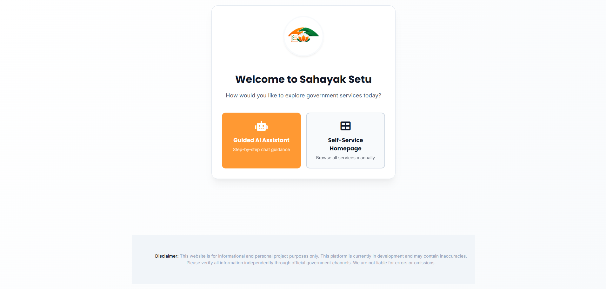
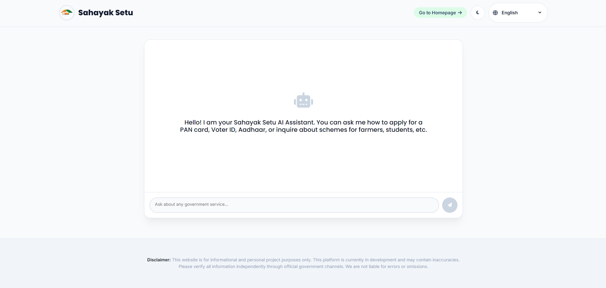
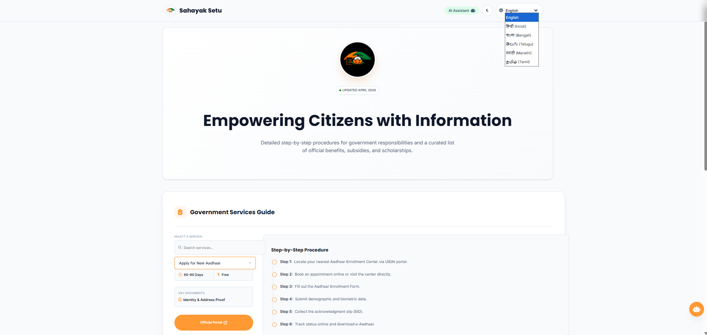

# Sahayak Setu (सहायक सेतु)

**Execute Government Services Independently. We show you exactly how and where.**

Sahayak Setu is a multilingual web platform designed to empower Indian citizens. It shifts away from being a passive information aggregator into an active execution platform, featuring interactive wizards, an eligibility funnel, and an in-house AI assistant.

## Core Features

### 1. Choose at your own convenience: either work independently or get chatbot assistance.


### 2. In-House AI Execution Bot – Helping you with government services, summarized.

A custom Rule-Based/RAG AI engine built directly into the client.
- **Privacy-First:** Runs entirely without OpenAI/Google API dependencies.
- **Structured Outputs:** The AI generates HTML cards, step-by-step lists, and actionable "Apply Now" buttons rather than unstructured text.
- **Strict Guardrails:** Automatically blocks out-of-scope queries.



### 3. Deep Multilingual Support (i18n)

Native, zero-dependency translation engine supporting six languages: English, Hindi, Bengali, Telugu, Marathi, and Tamil.


### 4. Schemes and Benefits Section
Scheme section added so that no yojna provided by govt is left un-delivered to people by governemt.


## Tech Stack

- **Frontend Framework:** React 18
- **Language:** TypeScript (Strict Mode)
- **Build Tool:** Vite
- **Styling:** Pure CSS (CSS Variables, Flexbox/Grid, 3D Transforms)
- **Deployment:** Vercel

## Project Structure

```text
sahayak-setu/
├── public/
│   ├── logo.png             # Favicon & UI Logo
│   └── hero-screenshot.png  # README Screenshots
├── src/
│   ├── App.tsx              # Core Application, AI Engine, & Database
│   ├── main.tsx             # React DOM Mounting
│   └── vite-env.d.ts
├── package.json
├── vercel.json              # Edge Network Caching & Gzip Rules
└── tsconfig.json
```

### ⚖️ Legal Disclaimer
This platform is a personal engineering project created for informational and execution-assist purposes only. We are an independent entity and are not affiliated with the Government of India. While we strive for accuracy, users must verify all data, documents, and procedures on official gov.in portals. We are not liable for any errors, omissions, or rejected applications.
